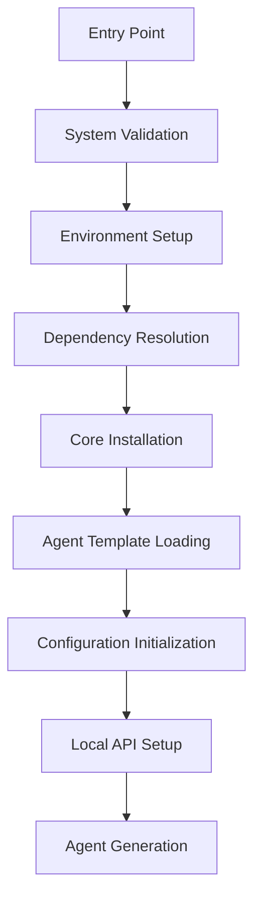

# SEED AI Framework

## Quick Install

Install with a single command:

```bash
curl -sSL https://raw.githubusercontent.com/Administratum227/seed-ai/main/install | bash
```

This will:
- Create virtual environment
- Install latest version
- Set up command-line tool

For AI agent generation, use the bootloader:

```bash
curl -sSL https://raw.githubusercontent.com/Administratum227/seed-ai/main/bootload | bash -s -- [--mode=<mode>] [--agent=<type>] [--config=<path>]
```

## Usage

After installation, simply run:

```bash
seed
```

For managing AI agents:

```bash
seed-agent [command] [options]
```

## Core Features

- 🤖 Simple AI Agent Management
- 📊 Real-time Dashboard
- 🔄 Task Orchestration
- 🌐 API Integration
- 🛡️ Secure Sandboxing
- 🔄 Version Control Integration
- 📦 Modular Plugin System

## Architecture

### System Overview

The SEED AI Framework is built on a modular, event-driven architecture that prioritizes security, extensibility, and ease of use. Here's a detailed breakdown of the system components:



### Core Components

#### 1. Environment Manager
Handles system environment setup and management:
- Virtual environment creation and maintenance
- Directory structure initialization
- Path configuration and validation
- Logging setup and rotation

```python
class EnvironmentManager:
    def __init__(self, config_path: str):
        self.base_path = os.path.expanduser("~/.seed")
        self.venv_path = os.path.join(self.base_path, "env")
        self.config = self._load_config(config_path)
```

#### 2. Security Sandbox
Provides isolated execution environments for AI agents:
- Process isolation and resource limits
- Network access control
- File system restrictions
- Permission boundary enforcement

```python
class SecuritySandbox:
    def __init__(self):
        self.permissions = self._setup_permissions()
        self.isolation = self._configure_isolation()
```

#### 3. Agent Template Engine
Manages agent generation and customization:
- Template loading and validation
- Configuration injection
- Dynamic code generation
- Version control integration

```python
class AgentTemplateEngine:
    def __init__(self, template_path: str):
        self.templates = self._load_templates(template_path)
        self.renderer = self._initialize_renderer()
```

#### 4. Plugin System
Enables extensibility through a modular plugin architecture:
- Dynamic plugin loading
- Dependency management
- Version compatibility checking
- Hot-reload capabilities

### Security Model

The framework implements a multi-layered security approach:

1. **Process Isolation**
   - Containerized execution environments
   - Resource usage limitations
   - Network access controls

2. **Permission Management**
   - Granular permission controls
   - Role-based access control
   - Dynamic permission adjustment

3. **Data Protection**
   - Encrypted storage
   - Secure communication channels
   - Access logging and monitoring

### Error Handling

Robust error handling is implemented throughout:

```python
class BootloadError(Exception):
    def __init__(self, message: str, code: int):
        self.message = message
        self.code = code
        super().__init__(self.message)

def handle_error(error: BootloadError):
    logger.error(f"Bootload failed: {error.message}")
    cleanup()
    sys.exit(error.code)
```

### Configuration Management

The framework uses a hierarchical configuration system:

```yaml
version: 1.0.0
agent:
  type: assistant
  mode: default
security:
  sandbox: true
  permissions: minimal
logging:
  level: info
  path: ~/.seed/logs
plugins:
  enabled: true
  autoload: false
```

### Development Guidelines

When contributing to the framework:

1. **Code Style**
   - Follow PEP 8 guidelines
   - Use type hints
   - Write comprehensive docstrings
   - Maintain test coverage

2. **Security Best Practices**
   - Validate all inputs
   - Use secure defaults
   - Implement proper error handling
   - Follow least privilege principle

3. **Documentation**
   - Keep README updated
   - Document all public APIs
   - Include usage examples
   - Maintain changelog

### System Requirements

- Python 3.8+
- 500MB minimum disk space
- Git
- POSIX-compliant system

### Recovery and Rollback

The framework includes comprehensive recovery mechanisms:

```python
class RollbackManager:
    def __init__(self):
        self.checkpoints = []
        self.state = {}
    
    def create_checkpoint(self):
        checkpoint = self._capture_state()
        self.checkpoints.append(checkpoint)
```

## Contributing

Contributions are welcome! Please read our [Contributing Guidelines](CONTRIBUTING.md) for details on our code of conduct and the process for submitting pull requests.

## License

This project is licensed under the MIT License - see the [LICENSE](LICENSE) file for details.